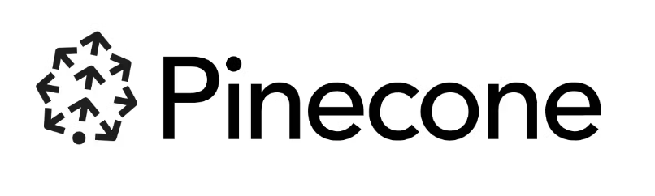

  

 

<h2 align="left">Hi there 👋, I'm Shreya Hegde</h2>

&nbsp;&nbsp;&nbsp;&nbsp;&nbsp;&nbsp;&nbsp;&nbsp;Bachelors of Engineering @Acharya Institute of Technology, Bengaluru. 
&nbsp;&nbsp;&nbsp;&nbsp;&nbsp;&nbsp;&nbsp;&nbsp;Majored in Artificial Intelligence and Machine Learning. 
&nbsp;&nbsp;&nbsp;&nbsp;&nbsp;&nbsp;✨&nbsp;&nbsp;Passionated towards Deep Learning and Natural Language Processing. 
&nbsp;&nbsp;&nbsp;&nbsp;&nbsp;&nbsp;&nbsp;&nbsp;Currently Exploring Generative AI. 
&nbsp;&nbsp;&nbsp;&nbsp;&nbsp;&nbsp;&nbsp;&nbsp;Always up for a Game of Chess. 
&nbsp;&nbsp;&nbsp;&nbsp;&nbsp;&nbsp;&nbsp;&nbsp;Looking for AI domain roles. 

## Connect 📩

  &nbsp;&nbsp;&nbsp;&nbsp;
  &nbsp;&nbsp;&nbsp;&nbsp;

## My Tech Stack

	<h4> Programming Lanauges</h4>

	&nbsp;
	&nbsp;
	&nbsp;
	&nbsp;

	<h4> Development</h4>

  &nbsp;
	&nbsp;
	&nbsp;
	&nbsp;	
	&nbsp;

	<h4>ML Frameworks and Vector DBs</h4>

	&nbsp;
	&nbsp;
  &nbsp;
	&nbsp;
	&nbsp;
	&nbsp;
  

	<h4>Libraries</h4>

	&nbsp;
	&nbsp;
	&nbsp;
	&nbsp;
  

  <h4>Environments</h4>

	&nbsp;
	&nbsp;
	&nbsp;
	&nbsp;
  

 

### Github Stats
 

  

    
        

  

           

